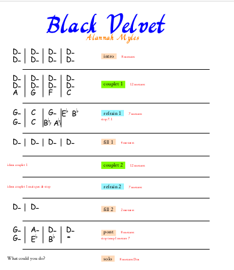
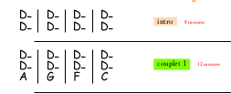
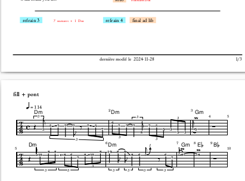
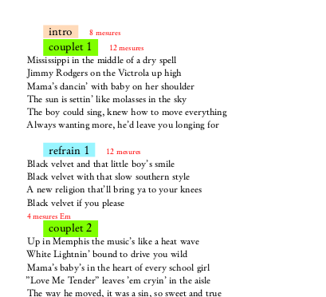

# What is this ?

This is a tool to build pdf and wav files, in a form suitable ( for me ) to play in a pop/rock/jazz band.
This needs to be :

- compact

partitions tend to be very long, pages long, but pop music is made of repetetions of verses, bridge, chorus, and I want
that to fit in one A4 page, so I can have it and play without turning the page.

- chord grid oriented

We want to see grid of chords, so in the band we easily agree on the structures, breaks, ...

- versioned in github, as text files. We don't want a word or other format

last modified date will automatically be updated.

- normalized

We want to have all music sheets with the same look

- support of real music notation

We want to able to import music notation, we choose lilypond music notation for that

- support of midi and wav export

We will use lilypond and synth for that.

- support for all latex features, in case we want to enhance the look of the lyrics. I have to admit that,
not being the singer in the band, I did not put much effort on that.
But this is latex, you can put anything you like.

- support for books ( set list )

a book is a list of songs. You usually work on a set list, and you don't want to browse your google drive to 
find each song when you rehearse. We want to have all of them in one file.

# How does it work ?

There is a tool written in rust, that is basically a code generator. It will generate :
- tex glue files
- OMakefile ( omake replacement for make )
from your songs. 

## what is a song ? 

A song is a directory in the tree ( look at [songs](songs)). It has :
- a song.json description file ( look at [song.json](songs/alannah_myles/black_velvet/song.json)
- a body.tex file ( it is the body of the `\begin{document} .... \end{document}` in latex)
- your stuff : latex files, lilypond files,... just declare them in the `song.json`

# How do I run it ?

look at [help.md](help.md)

