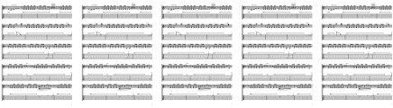
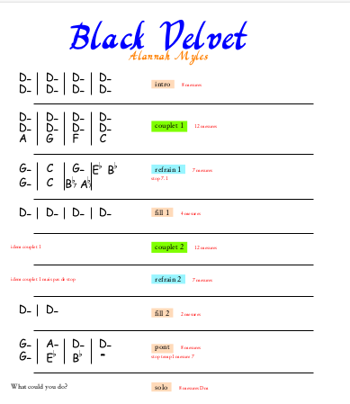
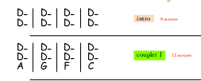
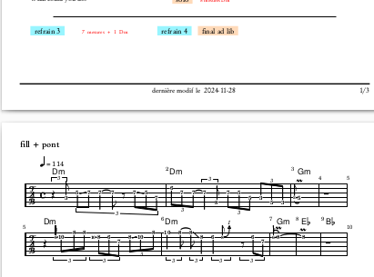
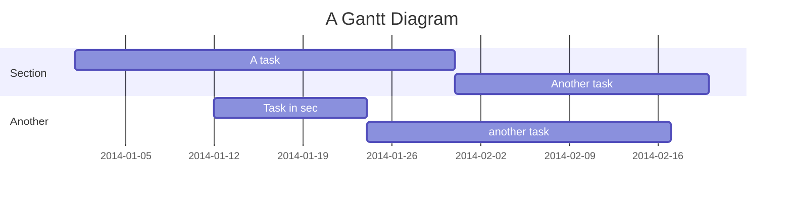
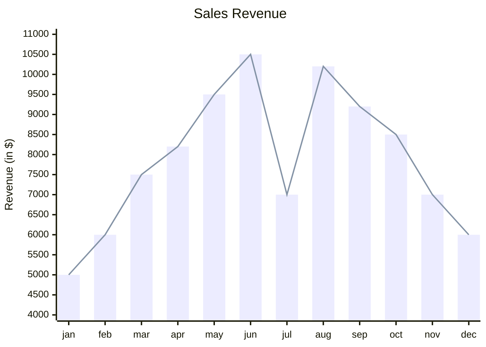

# Overview

This is a personal project, the target is to help me generate and maintain synthetic
songbooks, that I can use when playing with my amateur pop band.

Standard music notation looks something like this :

In pop music, this can be quite hard to follow, you may have 96 times the same chord, which ends up
in a music sheet of 5 pages with the same thing. When you play, you cannot turn the page,
so you want a synthetic view, with easy to visualize patterns ( ie verse, pre-chorus, chorus, bridge, ...),
with bar number, and annotations.

The goal is also for the band, not just for the guitar player, to have a short way to communicate about the song articulations, the breaks,
and so on. Of course this does not replace the need to learn the song by other means ( real score, learn by ear,
or any other way), and it does not replace having to practice your instrument with a full score support, or by ear.

The targeted goal is to have pdf files that you can either print or see on a tablet, such as :

## one A4 page

## easy to follow grid notation, one cell per bar

## a music sheet snippet, for the bridge

## lyrics are in sync with the score

This document has the following sections, that hopefully help to understand the :

- what do we want ( the specifications )
- the detailed design ( how is that written, how to maintain it )
- the user manual ( how to use it )
- the installation manual ( how to install it )

