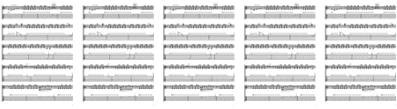
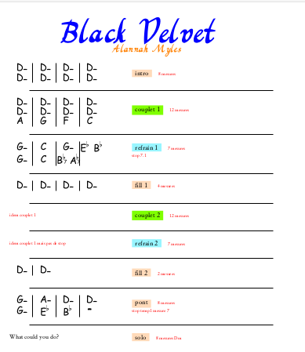
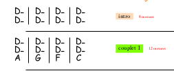
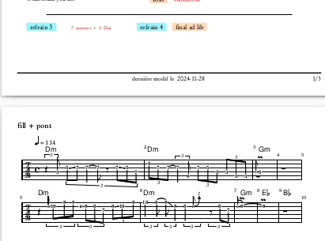
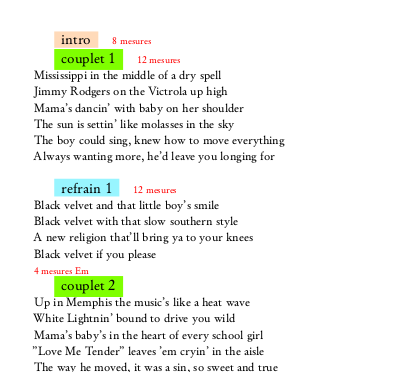

# Overview

Standard music notation looks something like this :

In pop music, this can be quite hard to follow, you may have 48 times the same chord, you cannot turn the page,
you want a synthetic view, with easy to visualize patterns ( ie verse, pre-chorus, chorus, bridge, ...),
with bar number, and annotations.

The goal is for a pop band to have an short way to communicate about the song articulations, the breaks,
and so on. Of course this does not replace the need to learn the song by other means ( real score, learn by ear,
or any other way).

The targeted goal is to have pdf files that you can either print or see on a tablet, such as :

This document has the following sections, that hopefully help to understand the :

- what do we want ( the specifications )
- the detailed design ( how is that written, how to maintain it )
- the user manual ( how to use it )
- the installation manual ( how to install it )
