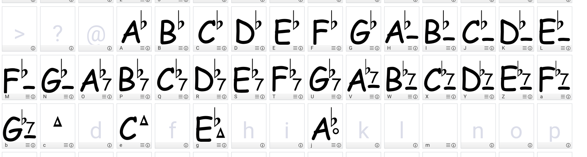

# <a id="top"/> fonts

we have our own fonts to display chords, each chord is a glyph

## <a id="birdfont"/> birdfont

we use the [birdfont](https://birdfont.org/) tool to edit the fonts. This tool has a commercial and a `SIL open font license`,
that you can use for free.

## capture fonts

use ``birdfont`` to load and modify a font.

all glyphs cannot be in one font, so we split them in three fonts :

1. ``software/fonts/songbook.birdfont`` : the fonts for chords
2. ``sofware/fonts/songbook_flat.birdfont`` : the fonts for flat chords
3. ``software/fonts/songbook_sharp.birdfont`` : the fonts for chords

For each font, we have, from letter A :
- major chords (A => G)
- minor chords (H => N)
- 7 chords ( O => U )
- minor 7 chords ( V => b )
- 7 major chords ( c => i )
- diminished chords ( j => p )
- suspended chords ( q => w )

## export fonts

use (Ctrl-e) menu (export fonts), it will export the fonts to ``ttf`` files.

## make them available

the pdf generator ``lualatex`` will look for additional fonts in ``$HOME/.fonts``, so copy the ttf files there.
Other tools like LibreOffice may look for the fonts in other locations, read the doc for these tools

## code generator

the mapping between chords and fonts is done in ```software/others/texfiles/chords.tex```.
if you change the organization of chords/glyphs/fonts, don't forget to update this file

For instance, we have for D flat 7 :

    \newcommand\chordDfsept{{\songbookfontflat\fontsize{18pt}{18pt}\selectfont R ~ }}

This is the ``songbook_flat`` font, so using letter `R` in our example we will have the wanted glyph :


@todo : finish writing the fonts

We use the same mechanism for the `pause` and `repeat` glyphs.
